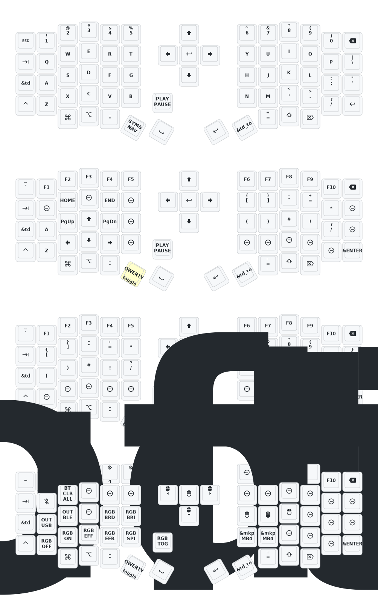

# ZMK code for sofle keyboard
  - Forked from [a741725193/zmk-sofle](https://github.com/a741725193/zmk-sofle)
  
## Features 
  - Double tap shift for caps lock
  - 4 layers of with different functionality
    - QWERTY: Basic qwerty lettering and top numbering
    - Symbols and Navigation: On the left arrow keys, home/end, page up/down, symbols on the right
    - Symbols and Numpad: On the left symbols, on the right numpad
    - RGB and Bluetooth: RGB on/off and modes. Change colours on the scroll wheel. Bluetooth options on the left, mouse functionality on the right    

---

# Sofle Keymap

